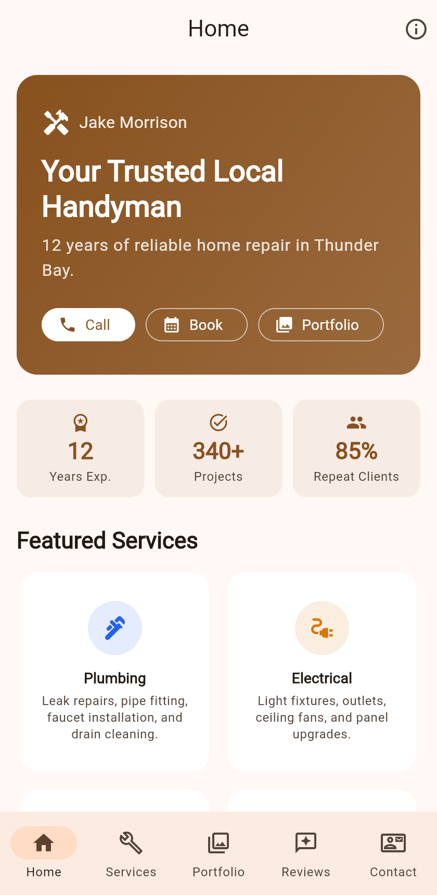
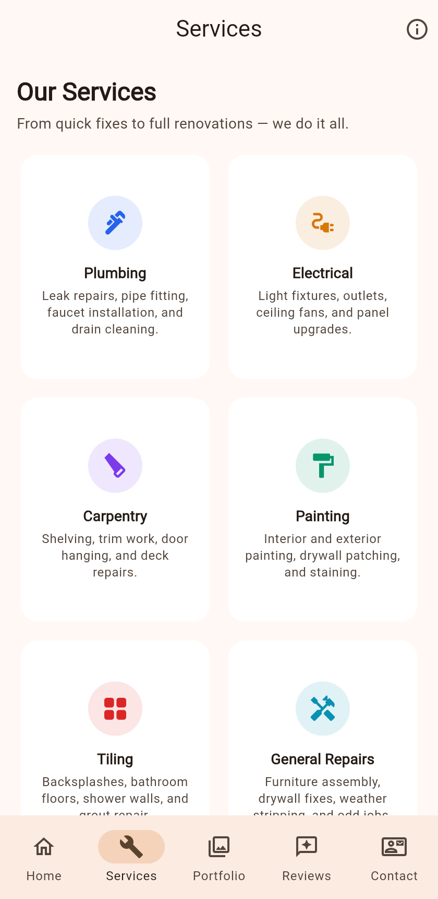
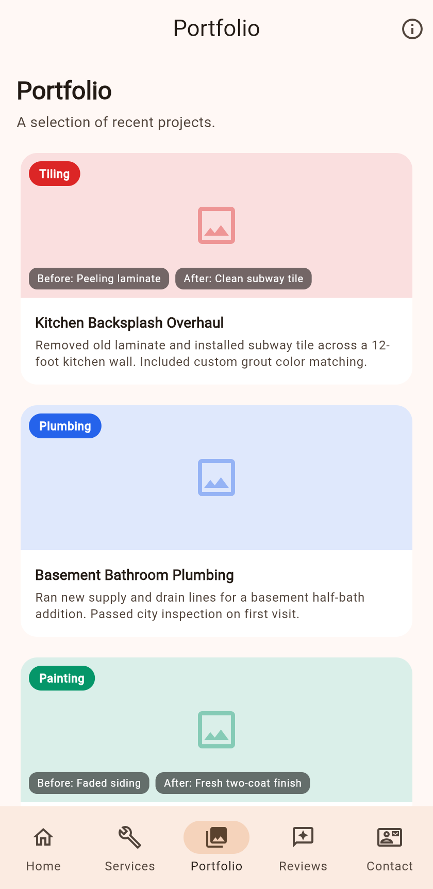

# Challenge 2 — Home Handyman Portfolio

**COMP5450 Mobile Programming · Group 5**

A Flutter app that acts as a portfolio website for a fictional home handyman service.
The idea is to showcase services, past projects, and customer reviews in a way that
would attract potential clients — not just dump a list of every detail.

**Course requirements (Challenge 2):** Flutter (Android Studio / IntelliJ IDEA recommended);
**Firebase / Cloud Firestore** stores services, projects, and reviews (contact messages
collection); **README.pdf** (this document’s PDF twin) includes configuration, **exact
project structure**, and **screenshots**; **public GitHub** link below; **D2L ZIP**
should include Dart sources, images (screenshots + network URLs in code), and
**README.pdf**; **Zoom presentation** is scheduled separately on D2L.

## What the app does

- **Home** — hero banner with quick-action buttons (Call, Book, Portfolio), three stat chips, and a preview of featured services.
- **Services** — grid of six service categories (Plumbing, Electrical, Carpentry, Painting, Tiling, General Repairs) with icons and short descriptions.
- **Portfolio** — scrollable list of completed project cards with category tags, descriptions, and before/after labels where applicable.
- **Reviews** — customer testimonial cards showing name, star rating, date, and a quote.
- **Contact** — phone, email, hours, service area info, plus a message form with client-side validation.
- **About** — accessible from the info icon in the app bar; shows bio, certifications, years of experience, and service area.

Navigation is handled by a Material 3 `NavigationBar` at the bottom (5 tabs).

## Architecture

The code follows a **repository pattern** plus a small **`PortfolioScope`**
(`InheritedWidget`) so every screen reads the same lists and repository.

- **`AppEntry`** — initializes **Firebase** when not in test mode, runs a one-time
  **Firestore seed** if collections are empty (copies from `mock_data.dart`), loads
  data through **`FirestorePortfolioRepository`**, and wraps the app in
  **`PortfolioScope`**. If Firebase is missing or fails (e.g. no
  `google-services.json`), it **falls back to `MockPortfolioRepository`** so the UI
  still runs.
- **`FirestorePortfolioRepository`** — reads `services`, `projects`, `reviews`;
  **`submitContact`** writes to `contact_messages` with a server timestamp.
- **`MockPortfolioRepository`** — used in tests (`AppEntry(forceMock: true)`) and as
  offline fallback.

```
lib/
  main.dart                          # binding + runApp(AppEntry)
  app_entry.dart                     # Firebase init, seed, PortfolioScope
  handyman_app.dart                  # MaterialApp + theme
  app_shell.dart                     # NavigationBar + tab pages
  portfolio_scope.dart               # InheritedWidget: lists + repository
  models/
    service.dart
    project.dart
    review.dart
  data/
    portfolio_repository.dart        # abstract interface
    mock_portfolio_repository.dart
    mock_data.dart                   # seed + hero / contact constants
    firestore_serializers.dart
    firestore_seeder.dart
    firestore_portfolio_repository.dart
  screens/ …
  widgets/ …
```

### Exact `lib/` and `test/` layout

```
lib/
  main.dart
  app_entry.dart
  handyman_app.dart
  app_shell.dart
  portfolio_scope.dart
  data/
    portfolio_repository.dart
    mock_portfolio_repository.dart
    mock_data.dart
    firestore_serializers.dart
    firestore_seeder.dart
    firestore_portfolio_repository.dart
  models/
    service.dart
    project.dart
    review.dart
  screens/
    home_screen.dart
    services_screen.dart
    portfolio_screen.dart
    about_screen.dart
    reviews_screen.dart
    contact_screen.dart
  widgets/
    hero_banner.dart
    stat_chip.dart
    service_card.dart
    project_card.dart
    review_card.dart
test/
  widget_test.dart
```

Supporting files: **`docs/FIREBASE_SETUP.md`**, **`firestore.rules`** (dev-only),
**`pubspec.yaml`**, platform folders **`android/`**, **`ios/`**, **`web/`**, etc.

See **[docs/FIREBASE_SETUP.md](docs/FIREBASE_SETUP.md)** for `google-services.json`,
Firestore rules, and optional FlutterFire CLI. Dev-only rules live in
**`firestore.rules`** (wide open — tighten for anything beyond coursework).

## How to configure and run

### Android Studio / IntelliJ IDEA (recommended)

1. Install [Flutter](https://docs.flutter.dev/get-started/install) and the **Flutter** + **Dart** plugins in the IDE.
2. **File → Open…** and select this project folder (the directory that contains `pubspec.yaml`).
3. Let the IDE run **`flutter pub get`** (or run it in the terminal below).

### Clone and run (terminal)

```
git clone https://github.com/achenachena/handyman-portfolio.git
cd handyman-portfolio
flutter pub get
flutter run            # pick an Android emulator or Chrome
flutter run -d chrome  # optional: force web
```

### Firebase (required for live cloud data)

1. Add **`android/app/google-services.json`** from the Firebase Console (package name must match `applicationId` in `android/app/build.gradle.kts`). See **[docs/FIREBASE_SETUP.md](docs/FIREBASE_SETUP.md)**.
2. Enable **Firestore** in the same Firebase project.

If `google-services.json` is missing, the app still runs using **in-memory mock data** (useful for grading without your keys), but it is **not** using Firebase until that file is present and Firestore is enabled.

Tested with Flutter 3.32+ on macOS.

## D2L submission ZIP (requirement #5)

The course text says the D2L package must include **all your Dart files + Images +
README.PDF** — not the whole Android Studio tree (that belongs on **public GitHub**,
requirement #4).

From this directory:

```bash
./package_d2l_zip.sh
```

That writes **`HandymanPortfolio-Challenge2.zip`** with **only**:

- every **`*.dart`** file under **`lib/`** and **`test/`** (folder layout preserved),
- the three **`screenshot-*.png`** images,
- **`README.pdf`**.

There is **no** `android/`, `pubspec.yaml`, `presentation/`, or other files inside that
ZIP. To **build or run** the app, graders clone the **GitHub** repo (link in README.pdf).

Regenerate **`README.pdf`** after README edits: `pip install reportlab` then
`python3 generate_pdf.py`.

## Tests

```
flutter test      # 7 widget tests — all pass
flutter analyze   # no issues
```

To rebuild **README.pdf** after editing this README or screenshots (requires Python **reportlab**):

```
pip install reportlab
python3 generate_pdf.py
```

## Screenshots

| Home | Services | Portfolio |
|------|----------|-----------|
|  |  |  |

## Portfolio images

Project cards load **header photos from the network** (`Image.network`) using URLs in
`lib/data/mock_data.dart` (Unsplash CDN). You need **internet** on the device/emulator
the first time images load. Android includes `INTERNET` in `AndroidManifest.xml`.

Photos are for **demo / coursework** only. Unsplash’s license allows this use; for a
public store listing you would swap in your own photos or assets. See
[Unsplash License](https://unsplash.com/license).

## Firebase & Firestore

The app uses **Firebase Core** + **Cloud Firestore** for portfolio lists and contact
submissions. Collections: **`services`**, **`projects`**, **`reviews`** (read by the
UI); **`contact_messages`** (writes from the Contact form). First launch **seeds**
empty collections from `mock_data.dart`.

Configure Android with **`android/app/google-services.json`** (see
[docs/FIREBASE_SETUP.md](docs/FIREBASE_SETUP.md)). Without it, the app uses mock data
automatically.

## GitHub

<https://github.com/achenachena/handyman-portfolio>

## Team — Group 5

*(see D2L for member list)*
